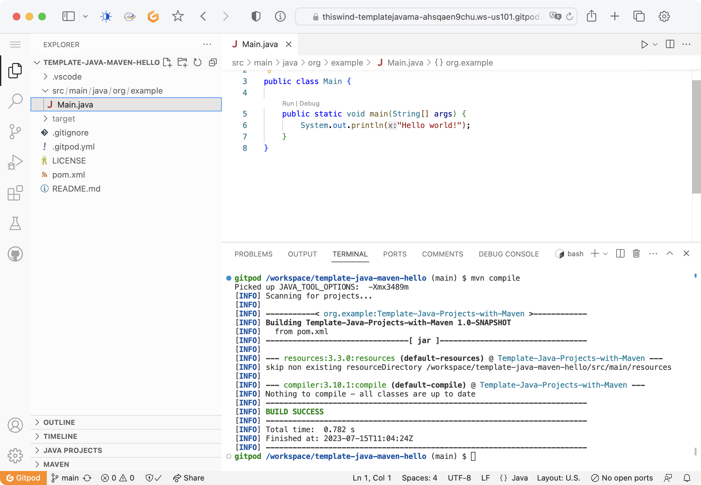

# Java Maven Hello Template

This is a [template](https://docs.github.com/en/repositories/creating-and-managing-repositories/creating-a-repository-from-a-template) project for developing [Java](https://openjdk.org/projects/jdk/11/) applications using [Maven](https://github.com/apache/maven) in an online development environment with [Gitpod](https://gitpod.io/). It provides a pre-configured setup with Maven and essential Java development plugins, allowing you to quickly start working on your Java projects without worrying about the initial setup.

This project is based on Gitpod an official [example](https://github.com/gitpod-samples/template-java-maven-mongodb.git).


## Screenshot




## Run and preview

Click the button below to start a new development environment:

[](https://gitpod.io#https://github.com/thiswind/template-java-maven-hello)


## Features

- Maven integration for managing dependencies and building the project.
- Ready-to-use Java development environment with essential plugins configured.
- Convenient directory structure for organizing your Java source code.

## Getting Started

To get started with this template, you have two options:

### Option 1: Create a New Project

1. Click on the "Use this template" button on the GitHub repository page to create a new repository based on this template.
2. Clone the newly created repository to your local machine using Git or any Git client.
3. Open the cloned repository in Gitpod by prefixing the repository URL with `https://gitpod.io/#`.

### Option 2: Fork the Template Project

1. Fork this template repository to your GitHub account.
2. Clone the forked repository to your local machine using Git or any Git client.
3. Open the cloned repository in Gitpod by prefixing the repository URL with `https://gitpod.io/#`.

## Project Structure

The project has the following structure:

```txt
./
├── .gitignore
├── .gitpod.yml
├── pom.xml
├── README.md
├── src
│   └── main
│       └── java
│           └── org
│               └── example
│                   └── Main.java
└── .vscode
    ├── launch.json
    └── settings.json
```

- `.gitignore`: Specifies the files and directories that Git should ignore.
- `.gitpod.yml`: Configuration file for Gitpod, defining the development environment.
- `pom.xml`: Maven configuration file for managing dependencies and building the project.
- `README.md`: This file, providing an overview and instructions for using the template.
- `src/main/java/org/example/Main.java`: Default entry point for your Java application.
- `.vscode/launch.json`: Configuration file for debugging in Visual Studio Code.
- `.vscode/settings.json`: Configuration file for Visual Studio Code settings.

## Usage

Once you have set up the project, you can start developing your Java application by modifying the `org.example.Main.java` class or adding additional Java classes in the `src/main/java/` directory. You can use Maven commands to build, run, and test your application.

If you need to modify the Main class of this Java project, please modify the `pom.xml` and the `.vscode/launch.json` by replacing `org.example.Main` with your own Main class.

## Contributing

If you encounter any issues or have suggestions for improvements, please feel free to open an issue or submit a pull request in the [GitHub repository](https://github.com/your-username/template-java-maven-hello).

## License

This template project is released under the [MIT License](LICENSE).